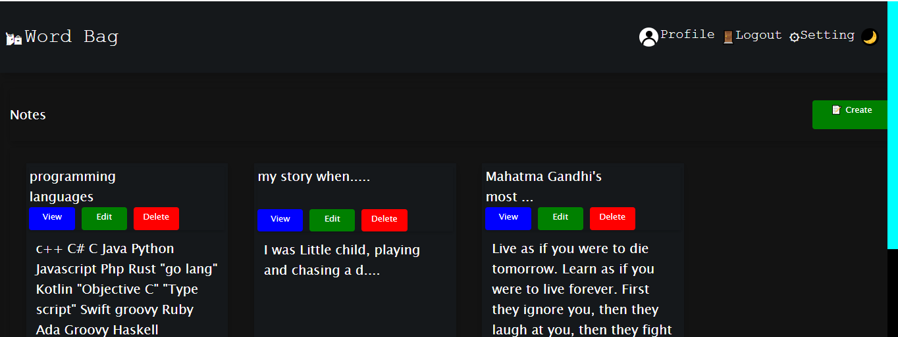
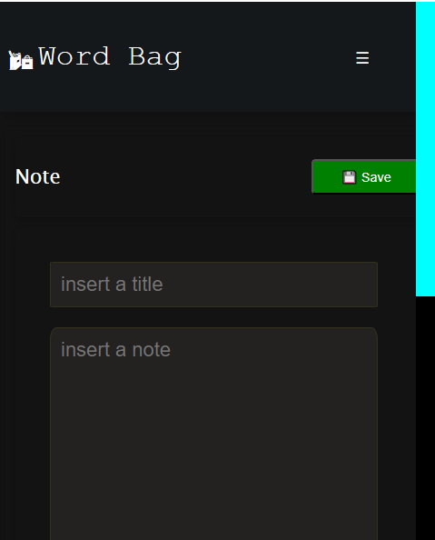

# Word Bag

responsive light weight web application  for storing a note, built
on top of laravel framework.

## Features

* user authenticaiton and autherization.
* responsive layout.
* bright and dark theme.
* custom components and styles
* default sqlite db

## Installation

To get a local copy up and running, follow these simple steps:

### prerequisites

PHP >= 8.0
Composer
Node.js & npm

### steps

`npm install`

`npm run build`

* Manually copy the js file to public dir
* After preprocessing css files, change the name of css files under `resources/view/layout/root.blade.php` and `resources/view/layout/guest.blade.php/` 

`composer install`

* create **database.sqlite** in **database/**
  
`cp .env.example .env`

`php artisan key:generate`

`php artisan migrate`

### running

`php artisan serve`

